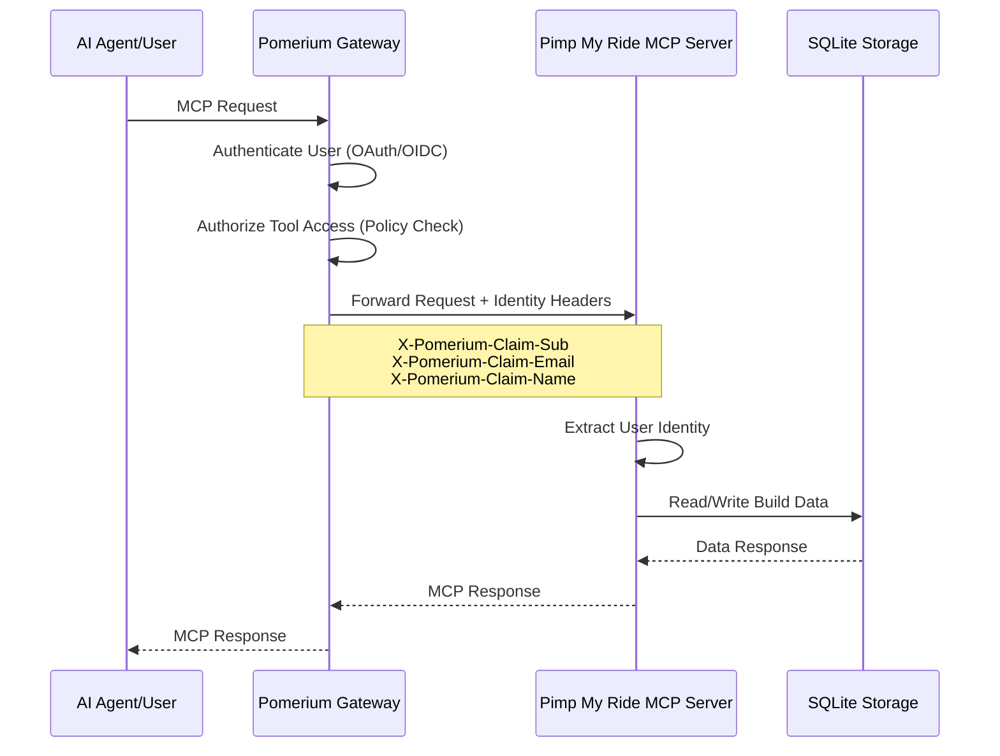

# 🏎️ Pimp My Ride MCP Server

A Model Context Protocol (MCP) server for car customization and racing. Build and customize your dream ride with natural language through ChatGPT or Claude!

## Features

- 🎨 **Car Customization** - Colors, wheels, body kits, spoilers, exhausts, decals, and underglow
- 🏎️ **Driver Profiles** - Choose your racing persona (RoadRage, SpeedDemon, CoolCalmCollected, etc.)
- 💾 **Build Management** - Save, load, and manage multiple car builds
- 📊 **Performance Scoring** - Get calculated performance scores for your builds
- 🔒 **Pomerium Authentication** - Secure identity-aware access with Pomerium proxy
- 🗄️ **Pluggable Storage** - SQLite by default, extensible to Redis, PostgreSQL, DynamoDB

## Security

⚠️ **This MCP server has no built-in authentication or authorization.** It reads identity from HTTP headers and trusts them implicitly.

For production deployments, **secure this server behind [Pomerium](https://www.pomerium.com/)**, an AI gateway that provides:

- 🔐 **Centralized Authentication** - OAuth/OIDC integration with your identity provider
- 🛡️ **Fine-grained Authorization** - Policy-based access control at the tool and method level
- 🔑 **Automatic Token Management** - Handles OAuth token refresh transparently
- 📊 **Observability** - Detailed logs of AI agent interactions, tool calls, and parameters
- 🌐 **Secure Gateway** - Expose internal MCP servers safely to AI agents

Pomerium enables you to define policies like:
- Which users can access which tools
- Rate limiting per user or group
- Audit logging of all tool calls
- Dynamic access control based on user attributes

### Architecture with Pomerium



**Learn more:** [Pomerium MCP Documentation](https://www.pomerium.com/docs/capabilities/mcp)

## Quick Start

### Installation

```bash
npm install
```

### Configuration

Create a `.env` file (see `.env.example`):

```bash
# Server Configuration
PORT=3000
NODE_ENV=development
LOG_LEVEL=info

# Storage Configuration
STORAGE_BACKEND=sqlite
SQLITE_DB_PATH=./data/pimp-my-ride.db
```

### Development

```bash
npm run dev
```

### Production

```bash
npm run build
npm start
```

## Available Tools

### Car Customization

#### `getCurrentBuild`
Retrieve or create your active car build with all customizations.

#### `updateCarConfig`
Update car attributes:
- **color** - Primary color (red, blue, green, yellow, orange, purple, pink, black, white, silver, gold, cyan, magenta, lime)
- **secondaryColor** - Secondary/accent color
- **wheels** - Wheel type (stock, sport, racing, offroad, chrome, neon, spinner)
- **bodyKit** - Body kit style (stock, sport, racing, drift, luxury, rally, muscle)
- **decal** - Decal/livery (none, racing_stripes, flames, tribal, camo, carbon_fiber, checkered, sponsor, custom)
- **spoiler** - Spoiler type (none, stock, sport, racing, gt_wing, ducktail)
- **exhaust** - Exhaust system (stock, sport, racing, dual, quad, side_exit)
- **underglow** - Underglow lighting (none, red, blue, green, purple, rainbow, white)
- **performance** - Performance stats (power, grip, aero, weight: 0-100)

#### `updateDriverProfile`
Set driver persona and nickname:
- **persona** - Driver personality: CoolCalmCollected, RoadRage, SpeedDemon, Cautious, ShowOff, Tactical, Wildcard
- **nickname** - Driver nickname (1-50 characters)

#### `getCustomizationOptions`
Get all available customization options for car parts and driver personas.

#### `getPersonaInfo`
Get detailed information about driver personas including racing style, strengths, and weaknesses.

### Build Management

#### `saveBuild`
Save the current car build under a specific name.

#### `loadBuild`
Load a saved car build and make it active.

#### `listBuilds`
List all saved car builds with pagination support.

#### `deleteBuild`
Delete a saved car build (cannot delete active build).

#### `getBuildDetails`
Get detailed information about a build including calculated performance score.

## Architecture

### Storage Layer

The KV storage abstraction provides:
- **Namespaces** - Logical data isolation
- **TTL Expiration** - Automatic cleanup of expired entries
- **CAS Versioning** - Compare-and-Set for concurrent updates
- **Pagination** - Cursor-based pagination for large datasets

Default implementation uses SQLite with WAL mode for better concurrency.

### Authentication

Pomerium authentication resolves user identity from HTTP headers:
- `X-Pomerium-Claim-Sub` - User ID
- `X-Pomerium-Claim-Email` - Email address
- `X-Pomerium-Claim-Name` - Display name
- `X-Pomerium-JWT-Assertion` - JWT token (fallback)

In development mode without Pomerium, the server generates anonymous session-based user IDs.

### Data Model

**Build Structure:**
```typescript
{
  id: string,
  name?: string,
  car: {
    color, secondaryColor, wheels, bodyKit,
    decal, spoiler, exhaust, underglow,
    performance: { power, grip, aero, weight }
  },
  driver: {
    persona, nickname?
  },
  createdAt: number,
  updatedAt: number
}
```

## API Endpoints

### MCP Protocol
- `POST /mcp` - MCP tool calls
- `GET /mcp` - Server info

### Health Check
- `GET /health` - Storage health status

## Environment Variables

| Variable | Description | Default |
|----------|-------------|---------|
| `PORT` | Server port | `3000` |
| `NODE_ENV` | Environment (development/production/test) | `development` |
| `LOG_LEVEL` | Logging level (error/warn/info/debug) | `info` |
| `STORAGE_BACKEND` | Storage type (sqlite/redis/postgres/dynamodb) | `sqlite` |
| `SQLITE_DB_PATH` | SQLite database file path | `./data/pimp-my-ride.db` |
| `SQLITE_VERBOSE` | Enable SQL query logging | `false` |

## Development

### Scripts

```bash
npm run dev          # Development with watch mode
npm run build        # Build for production
npm start            # Start production server
npm run lint         # Check code quality
npm run lint:fix     # Fix linting issues
npm run format       # Format code with Prettier
npm test             # Run tests
```

### Project Structure

```
src/
├── index.ts              # Main server entry point
├── config.ts             # Environment configuration
├── logger.ts             # Structured logging
├── auth/
│   └── pomerium.ts       # Pomerium authentication
├── domain/
│   └── models.ts         # Car and driver models
├── storage/
│   ├── kv.ts            # KV storage interface
│   ├── sqlite.ts        # SQLite implementation
│   ├── factory.ts       # Storage factory
│   └── index.ts         # Exports
├── tools/
│   └── builds.ts        # Build management tools
└── lib/
    ├── utils.ts         # MCP response helpers
    └── errors.ts        # Error formatting
```

## Deployment

### Docker (Coming Soon)

```bash
docker build -t pimp-my-ride-mcp .
docker run -p 3000:3000 -v ./data:/app/data pimp-my-ride-mcp
```

### With Pomerium (Recommended for Production)

Deploy behind Pomerium for secure, policy-based access control:

```yaml
# pomerium-config.yaml
routes:
  - from: https://pimp-my-ride.example.com
    to: http://localhost:3000
    policy:
      - allow:
          and:
            - email:
                is: user@example.com
    # Optional: Fine-grained tool access control
    mcp_allow_tools:
      - getCurrentBuild
      - updateCarConfig
      - updateDriverProfile
```

See [Pomerium MCP docs](https://www.pomerium.com/docs/capabilities/mcp) for advanced configuration including:
- Tool-level authorization
- User/group-based access control
- Rate limiting
- OAuth upstream integration

## Roadmap

### Phase 2 - AI Assistance
- [ ] `randomizeBuild` - Generate random themed builds
- [ ] `suggestUpgrades` - AI-powered upgrade recommendations
- [ ] `generateLivery` - Color scheme suggestions

### Phase 3 - Racing
- [ ] `simulateRace` - Race simulation
- [ ] `getLeaderboard` - Global rankings
- [ ] Race results persistence

## License

MIT

## Documentation

- **[Product Requirements Document (PRD)](docs/PRD.md)** - Detailed architecture, data models, and implementation phases
- **[Repository Guidelines (AGENTS.md)](AGENTS.md)** - Development conventions, testing, and contribution guidelines

## About Pomeranian Kart

Pomeranian Kart is a racing game that uses this MCP server for car customization. Players interact with the game through natural language, building and customizing their dream cars before racing.

## References

- [Model Context Protocol](https://modelcontextprotocol.io/)
- [Pomerium Documentation](https://www.pomerium.com/docs/)
- [OpenAI Apps SDK](https://developers.openai.com/docs/apps-sdk)
